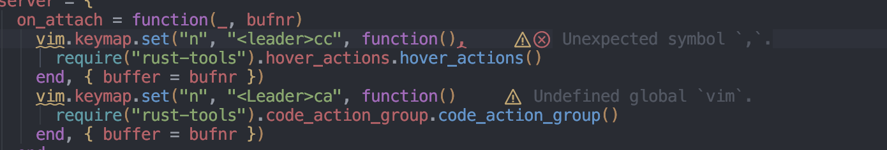

# Better Virtual Text

**Disclaimer** This is for my personal configuration. Use at your own risk!



Improve virtual text of diagnostic messages in Neovim.

This "plugin" builds on
[this pull-request](https://github.com/neovim/neovim/pull/22965), which will
enable the `prefix` of the `virtual_text` configuration option to be a function,
by adding additional highlight groups for "better" rendering. In essence, the
plugin "copy/pastes" the default `virtual_text` configuration from Neovim and
extends it with additional prefix groups.

## Installation

### Lazy

```lua
{
  "isaksamsten/better-virtual-text",
  config = true
}
```

### Configuration

The default configuration setup links between the highlights groups and the
default diagnostic virtual text highlight groups.

```lua
require("better-virtual-text").setup({})
```

We can configure the highlight groups by specifying the `highlights` option:

```lua
require("better-virtual-text").setup({
  highlights = {
    BetterVirtualTextError = {fg = "NonText" },
    BetterVirtualTextWarn = {fg = "NonText" },
    BetterVirtualTextInfo = {fg = "NonText" },
    BetterVirtualTextHint = {fg = "NonText" },
    BetterVirtualTextPrefixError = {link = "DiagnosticSignError" },
    BetterVirtualTextPrefixWarn = {link = "DiagnosticSignWarn" },
    BetterVirtualTextPrefixInfo = {link = "DiagnosticSignInfo" },
    BetterVirtualTextPrefixHint = {link = "DiagnosticSignHint" },
  }
})
```

Then we can enable it up through `vim.diagnostic.config`:

```lua
vim.diagnostic.config({
  virtual_text = false, -- Don't forget to disable virtual_text
  better_virtual_text = {
    prefix = function(diagnostic)
      if diagnostic.severity == vim.diagnostic.severity.ERROR then
        return   -- Nerd font icon for error
      elseif diagnostic.severity == vim.diagnostic.severity.WARN then
        return   -- Nerd font icon for warning
      elseif diagnostic.severity == vim.diagnostic.severity.INFO then
        return   -- Nerd font icon for info
      else
        return   -- Nerd font icon for hint
      end
    end,
  }
}
})
```
